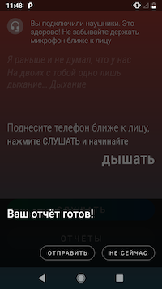
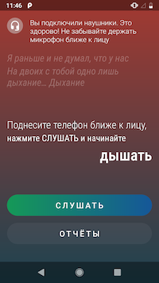

### Yandex Cup 2021. Мобильная разработка: Android

#### Task.A:
```
A. Уроки Йоги
Алёна очень любит заниматься йогой, но постоянно забывает дышать правильно.
 Напишите приложение, которое будет определять с помощью встроенного микрофона, когда она делает вдох, когда — выдох, а когда вообще задержала дыхание, чтобы ее тренер Аркадий смог помочь ей тренировать дыхание.
Решение должно определять вдох, выдох и время между ними.

Приложение должно:
определять момент вдоха,
определять момент выдоха,
считать и фиксировать время между вдохом-выдохом и выдохом-вдохом,
составлять список вдохов-выдохов с зафиксированным временем между ними,
отправлять список по электронной почте тренеру Аркадию.
```

#### Screenshots
Permission screen  


Home screen  


Reports screen  


